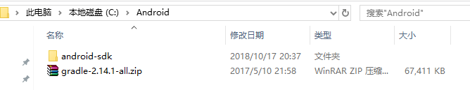
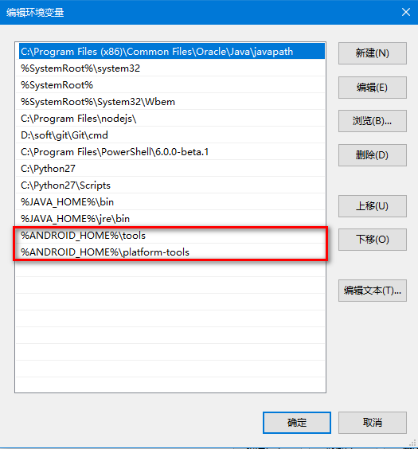

# Windows 环境搭建

## 1、安装 Node

​	下载地址:
​		https://nodejs.org/en/

## 2、安装 JDK8.x

​	下载地址:
​		https://www.oracle.com/technetwork/java/javase/downloads/jdk8-downloads-2133151.html
​		然后下一步下一步安装即可

​	安装好后的文件目录默认在 `C:\Program Files\Java`

​	接下来配置环境变量

​	

​	

## 3、安装Git

​	下载地址:
​		https://git-scm.com/downloads

## 4、安装 Android sdk

​	下载地址:
​		https://blog.csdn.net/QQxiaoqiang1573/article/details/73274771
​		百度盘：https://pan.baidu.com/s/1ImnzcYV0wtNfqH2-BM-QSQ
​	下载后 解压到 C 盘 或者任意盘
​	

​	接下来配置环境变量

​	

​	

## 5、安装 Android 模拟器

​	推荐夜神模拟器，轻量级并且使用方便，下载地址:https://www.yeshen.com/
​	

## 6、安装python2.x

​	下载地址:
​		https://www.python.org/downloads/

​		默认下一步下一步安装

​	然后配置环境变量

​	

配置完成后 打开命令窗口运行 `adb`  有如下提示即为配置成功

# 初始化 RN 项目并且连接到模拟器

1、安装 react-native cli 工具

`npm install -g react-native-cli`

2、新建项目

`react-native init testProject`

3、连接模拟器

夜神模拟器 默认端口 62001

`adb connect 127.0.0.1:62001`

4、运行项目到模拟器上

`cd AwesomeProject`
`react-native run-android`

此时可能会报错   **`could not connect to development server`**

解决方案 :

1. `ipconfig` 查看本机 IP 

2. 打开夜神模拟器 配置 IP 

   

   

   

   本地 IP : 8081 

   配置完成后再次运行  `react-native run-android`

3. 模拟器报错 `**unable to load script from assets ‘index.android bundle’ ,make sure your bundle is packaged correctly or youu’re runing a packager server**`

   解决办法 
   1，在 `android/app/src/main` 目录下创建一个 assets空文件夹

   `mkdir android/app/src/main/assets`

   2、在项目根目录运行

   `react-native bundle --platform android --dev false --entry-file index.js --bundle-output android/app/src/main/assets/index.android.bundle --assets-dest android/app/src/main/res/`

   3，重新`react-native run-android`