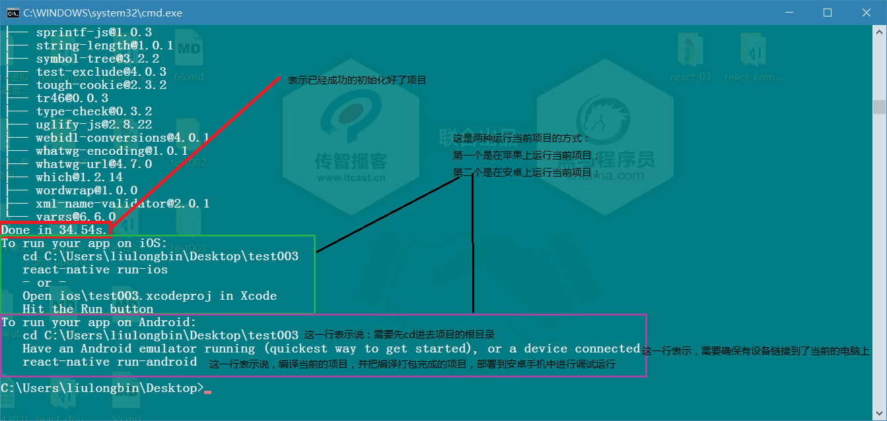
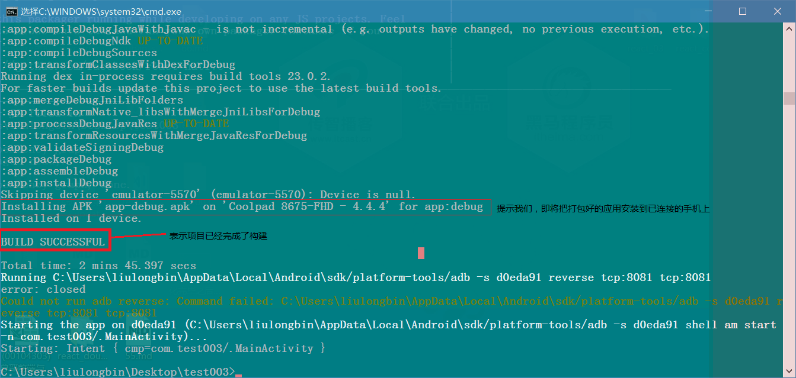
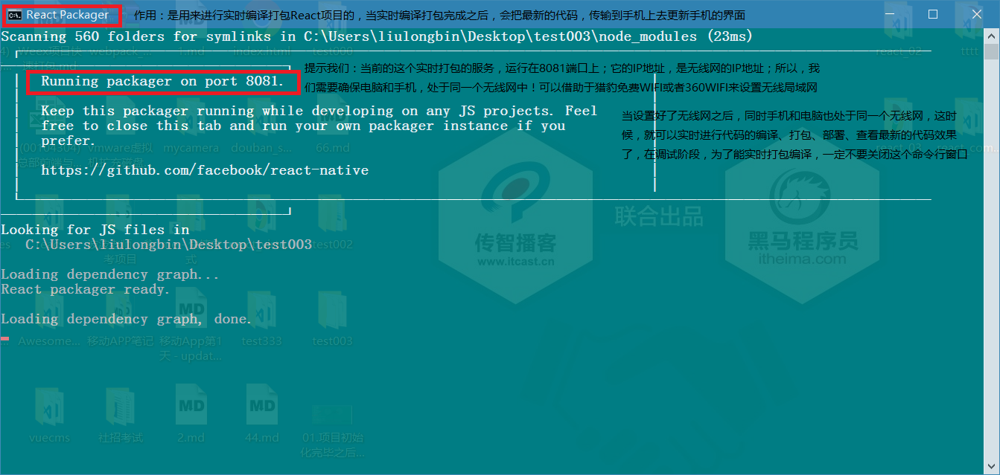
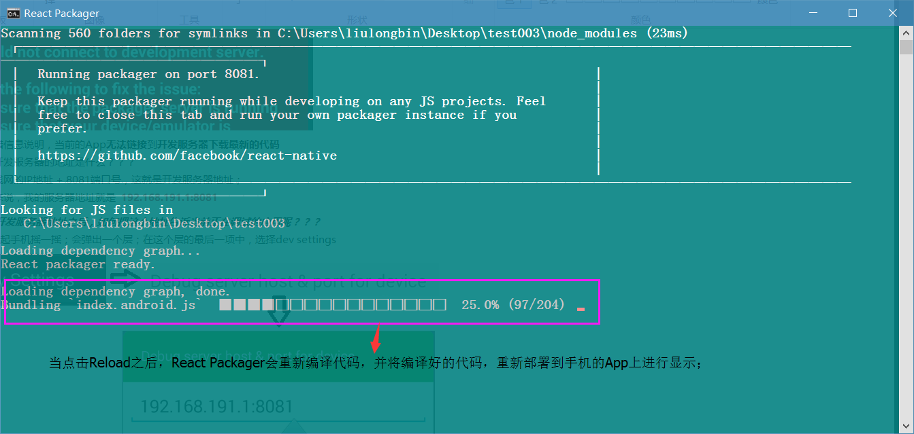
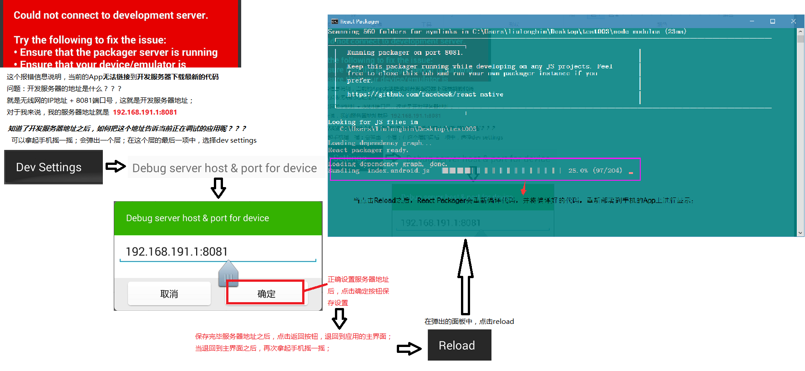

## 移动App开发环境配置【重点】


### 安装最新版本的java jdk
1. 修改环境变量，新增`JAVA_HOME`的系统环境变量，值为`C:\Program Files (x86)\Java\jdk1.8.0_112`，也就是安装JDK的根目录
2. 修改系统环境变量`Path`，在`Path`之后新增`%JAVA_HOME%\bin;%JAVA_HOME%\jre\bin;`
3. 新建**系统环境变量**`CLASSPATH`，值为`.;%JAVA_HOME%\lib\dt.jar;%JAVA_HOME%\lib\tools.jar;`
4. 保存所有的系统环境变量，同时退出系统环境变量配置窗口，然后运行cmd命令行工具，输入`javac`，如果能出现javac的命令选项，就表示配置成功！

### 安装Node.js环境
注意：需要安装最新的长期稳定版本，不要实验版本；安装完毕之后的node.js会自动配置到全局系统环境变量中
安装完毕后，可以输入`node -v`查看node版本号；

### 安装C++环境
大多数情况下操作系统自带C\++环境，不需要手动安装C\++环境；
如果运行报错，则需要手动安装visual studio中的C\++环境；

### 安装Git环境
Git安装完毕后，会自动配置到系统环境变量中；
可以通过运行`git --version`来检查是否正确安装和配置了Git的环境变量；

### 安装Python环境
1. 注意：安装Python时候，只能**安装2.×的版本**，注意勾选安装界面上的`Add Python to path`，这样才能自动将Python安装到系统环境变量中；
2. 安装完毕之后，可以在命令行中运行`python`，检查是否成功安装了python。

### 配置安卓环境
1. 安装`installer_r24.3.4-windows.exe`，最好手动选择安装到C盘下的android目录
2. 打开安装的目录，将`android-25`、`android-23`(react-native必须依赖这个)解压后，放到`platforms`文件夹下
3. 解压`platform-tools`，放到`platform-tools`文件夹下
4. 【这一步直接忽略即可！】**tools文件夹不解压覆盖也行；**~~解压`tools`，放到安装根目录中~~
5. 解压`build-tools_r23.0.1-windows.zip(react-native必须依赖这个)`、`build-tools_r23.0.2-windows.zip(weex必须依赖这个)`和`build-tools_r23.0.3-windows.zip`，并将解压出来的文件夹，分别改名为版本号`23.0.1`、`23.0.2`和`23.0.3`；在安装目录中新建文件夹`build-tools`，并将改名为版本号之后的文件夹，放到新创建出来的`build-tools`文件夹下
6. 在安装目录中，新建`extras`文件夹，在`extras`文件夹下新建`android`文件夹；解压`m2responsitory`文件夹和`support`文件夹，放到新建的`extras -> android`文件夹下
7. 配置安装环境变量：在系统环境变量中新建`ANDROID_HOME`，值为android SDK Manager的安装路径`C:\Users\liulongbin\AppData\Local\Android\android-sdk`，紧接着，在Path中新增`;%ANDROID_HOME%\tools;%ANDROID_HOME%\platform-tools;`

## [ReactNative快速打包](http://reactnative.cn/docs/0.42/getting-started.html)
1. 安装完node后建议**设置npm镜像**以加速后面的过程（或使用科学上网工具）。注意：**不要使用cnpm！**cnpm安装的模块路径比较奇怪，packager不能正常识别！
 > npm config set registry https://registry.npm.taobao.org --global<br/>
 >
 > > npm config set disturl https://npm.taobao.org/dist --global

2. Yarn、React Native的命令行工具（react-native-cli）
 + Yarn是Facebook提供的替代npm的工具，可以加速node模块的下载。React Native的命令行工具用于执行创建、初始化、更新项目、运行打包服务（packager）等任务。

    > npm install -g yarn react-native-cli

 + 安装完yarn后同理也要设置镜像源：
     > yarn config set registry https://registry.npm.taobao.org --global<br/>
     > yarn config set disturl https://npm.taobao.org/dist --global

3. 运行`react-native init AwesomeProject`创建React-Native项目
4. 运行`cd AwesomeProject`切换到项目根目录中，运行`adb devices`来确保有设备连接到了电脑上
5. 运行`react-native run-android`打包编译安卓项目，并部署到模拟器或开发机中
6. 运行上一条命令之前，要确保有设备连接到了电脑上，可以运行`adb devices`查看当前接入的设备列表，打包好的文件，放到了`android\app\build\outputs\apk`目录下
7. [入坑指南](http://www.open-open.com/lib/view/open1477469117948.html)
  > **问题1：开启悬浮框权限；**<br/>
  > **问题2：Could not get BatchedBridge, make sure your bundle is packaged correctly**<br/>
  > 解决方案：在终端中，进入到项目的根目录，执行下面这段命令行：<br/>
  > `react-native bundle --platform android --dev false --entry-file index.android.js --bundle-output android/app/src/main/assets/index.android.bundle --assets-dest android/app/src/main/res/`<br/>
  > 运行之前，需要确保`android/app/src/main/`目录下有`assets`文件夹，如果没有，手动创建之~，再运行上面的命令；<br/>
  > **问题3：could not connect to development server**<br/>
  > 解决方案：晃动手机，唤起设置属性窗口，点击“Dev settings”，再点击Debuug server host 出现设置ip地址窗口，填写Ip地址和端口号8081，例如`192.168.1.111:8081`


## [Weex快速打包](http://weex.apache.org/cn/guide/tools/toolkit.html)
1. 安装依赖:Weex 官方提供了 weex-toolkit 的脚手架工具来辅助开发和调试。首先，你需要最新稳定版的 Node.js 和 Weex CLi。
2. 运行`npm install -g weex-toolkit`安装Weex 官方提供的 `weex-toolkit` 脚手架工具到全局环境中
3. 运行`weex create project-name`初始化Weex项目
4. 进入到项目的根目录中，打开cmd窗口，运行`weex platform add android`安装android模板，首次安装模板时，等待时间较长，建议fq安装模板
5. 打开`android studio`中的`安卓模拟器`，或者将`启用USB调试的真机`连接到电脑上，运行`weex run android`，打包部署weex项目
6. 部署完成，查看项目效果


## 配置ReactNative基本开发环境
[搭建基本的开发环境 - 英文官网](http://facebook.github.io/react-native/docs/getting-started.html)<br/>
[搭建基本的开发环境 - 中文](http://reactnative.cn/docs/0.42/getting-started.html#content)
这两篇文档对比着进行参考，进行相关的安装；

## 手机的相关配置
1. 使用数据线，把手机链接到电脑上；
2. 运行 `adb devices` 的命令，这个命令，是安卓开发环境提供的；
3. 需要先开启手机的`开发者模式`
4. 如果开启开发者模式之后，还是看不到设备，则尝试安装 `豌豆荚` 这样的工具，让这些工具帮助你在电脑上安装手机的驱动；

## 搭建RN的项目
1. 运行`react-native init 项目名称`来初始化一个react native项目；

2. 打包运行项目，把打包好的项目部署到手机中！
 + 确保手机已经正确的链接到了当前电脑上，同时手机开启了`开发者调试模式`；可以使用`adb devices`来查看当前链接到电脑上的手机设备列表！
 + 当确认手机正确链接到电脑上之后，可以运行`react-native run-android`来打包当前项目，并把打包好的项目以调试的模式安装到手机中！
 + 打包完成之后的截图

 + React Package窗口的作用

 + 04.React  Packager打包编译代码截图

 + 当第一打包编译项目部署到手机上之后 - 如何设置开发服务器的地址


## [配置Tab栏](https://github.com/happypancake/react-native-tab-navigator)


## [配置Tab栏的图标](https://github.com/oblador/react-native-vector-icons)
> 注意：使用图标，需要使用 `Android SDK Manager` 安装 `Android SDK Build-tools 26.0.1` 并接收其 license;


## 安装路由
1. 运行`npm i react-native-router-flux --save`
2. 路由官网：`https://github.com/aksonov/react-native-router-flux`
3. 路由相关配置：`https://github.com/aksonov/react-native-router-flux/blob/master/docs/API.md`
4. 路由简单的DEMO：`https://github.com/aksonov/react-native-router-flux/blob/v3/docs/MINI_TUTORIAL.md`


## 配置首页的轮播图
1. 轮播图官网：`https://github.com/leecade/react-native-swiper?utm_source=tuicool&utm_medium=referral`
2. 运行`npm i react-native-swiper --save`安装轮播图组件
3. 导入轮播图组件`import Swiper from 'react-native-swiper';`
4. 其中，在Swiper身上，`showsPagination={false}`是用来控制页码的；`showsButtons={false}`是用来控制左右箭头显示与隐藏；`height={160}`是用来控制轮播图区域的高度的！
5. 设置轮播图的样式：
```
var styles = StyleSheet.create({
    wrapper: {},
    slide1: {
        flex: 1,
        justifyContent: 'center',
        alignItems: 'center',
        backgroundColor: '#9DD6EB',
    },
    slide2: {
        flex: 1,
        justifyContent: 'center',
        alignItems: 'center',
        backgroundColor: '#97CAE5',
    },
    slide3: {
        flex: 1,
        justifyContent: 'center',
        alignItems: 'center',
        backgroundColor: '#92BBD9',
    },
    image:{
        width:'100%',
        height:'100%'
    }
})
```
6. 将组件的代码结构引入到页面上：
```
<Swiper style={styles.wrapper} showsButtons={true} height={160} autoplay={true}>
                <View style={styles.slide1}>
                    <Image source={{uri:'http://www.itcast.cn/images/slidead/BEIJING/2017410109413000.jpg'}} style={styles.image}></Image>
                </View>
                <View style={styles.slide2}>
                    <Image source={{uri:'http://www.itcast.cn/images/slidead/BEIJING/2017440109442800.jpg'}} style={styles.image}></Image>
                </View>
                <View style={styles.slide3}>
                    <Image source={{uri:'http://www.itcast.cn/images/slidead/BEIJING/2017441409442800.jpg'}} style={styles.image}></Image>
                </View>
            </Swiper>
```


## 调用摄像头拍照
[react-native-image-picker的github官网](https://github.com/marcshilling/react-native-image-picker)
[react native 之 react-native-image-picke的详细使用图解](http://www.cnblogs.com/shaoting/p/6148085.html)
1.  运行`npm install react-native-image-picker@latest --save`安装到项目运行依赖，此时调试**可能会报错**，如果报错，需要使用下面的步骤解决：
	+ 先删除`node_modules`文件夹
	+ 运行`npm i`
	+ 运行`npm start --reset-cache`
2. 运行`react-native link`自动注册相关的组件到原生配置中
3. 打开项目中的`android`->`app`->`src`->`main`->`AndroidManifest.xml`文件，在第8行添加如下配置：
```
<uses-permission android:name="android.permission.CAMERA" />
<uses-permission android:name="android.permission.WRITE_EXTERNAL_STORAGE"/>
```
4. 打开项目中的`android`->`app`->`src`->`main`->`java`->`com`->`当前项目名称文件夹`->`MainActivity.java`文件，修改配置如下：
    ```
    package com.native_camera;
    import com.facebook.react.ReactActivity;

    // 1. 添加以下两行：
    import com.imagepicker.permissions.OnImagePickerPermissionsCallback; // <- add this import
    import com.facebook.react.modules.core.PermissionListener; // <- add this import

    public class MainActivity extends ReactActivity {
        // 2. 添加如下一行：
        private PermissionListener listener; // <- add this attribute

        /**
         * Returns the name of the main component registered from JavaScript.
         * This is used to schedule rendering of the component.
         */
        @Override
        protected String getMainComponentName() {
            return "native_camera";
        }
    }
    ```
5. 在项目中添加如下代码：
    ```
    // 第1步：
    import {View, Button, Image} from 'react-native'
    import ImagePicker from 'react-native-image-picker'
    var photoOptions = {
      //底部弹出框选项
      title: '请选择',
      cancelButtonTitle: '取消',
      takePhotoButtonTitle: '拍照',
      chooseFromLibraryButtonTitle: '选择相册',
      quality: 0.75,
      allowsEditing: true,
      noData: false,
      storageOptions: {
        skipBackup: true,
        path: 'images'
      }
    }

    // 第2步：
    constructor(props) {
    super(props);
        this.state = {
          imgURL: ''
        }
      }

	// 第3步：
    <Image source={{ uri: this.state.imgURL }} style={{ width: 200, height: 200 }}></Image>
    <Button title="拍照" onPress={this.cameraAction}></Button>

    // 第4步：
    cameraAction = () => {
    ImagePicker.showImagePicker(photoOptions, (response) => {
      console.log('response' + response);
      if (response.didCancel) {
        return
      }
      this.setState({
        imgURL: response.uri
      });
    })
    }
    ```
6. **一定要退出之前调试的App**，并重新运行`react-native run-android`进行打包部署；这次打包期间会下载一些jar的包，需要耐心等待！

## 签名打包发布Release版本的apk安装包
+ 请参考以下两篇文章：
 - [ReactNative之Android打包APK方法（趟坑过程）](http://www.jianshu.com/p/1380d4c8b596)
 - [React Native发布APP之签名打包APK](http://blog.csdn.net/fengyuzhengfan/article/details/51958848)

### 如何发布一个apk
1. 先保证自己正确配置了所有的 RN 环境
2. 在 cmd 命令行中，运行这一句话`keytool -genkey -v -keystore my-release-key2.keystore -alias my-key-alias2 -keyalg RSA -keysize 2048 -validity 10000`
 + 其中： `my-release-key.keystore` 表示你一会儿要生成的那个 签名文件的 名称【很重要，包找个小本本记下来】
 + `-alias` 后面的东西，也很重要，需要找个小本本记下来，这个名称可以根据自己的需求改动`my-key-alias`
 + 当运行找个命令的时候，需要输入一系列的参数，找个口令的密码，【一定要找个小本本记下来】
3. 当生成了签名之后，这个签名，默认保存到了自己的用户目录下`C:\Users\liulongbin\my-release-key2.keystore`
4. 将你的签名证书copy到 android/app目录下。
5. 编辑 `android` -> `gradle.properties`文件，在最后，添加如下代码：
```
MYAPP_RELEASE_STORE_FILE=your keystore filename
MYAPP_RELEASE_KEY_ALIAS=your keystore alias
MYAPP_RELEASE_STORE_PASSWORD=*****
MYAPP_RELEASE_KEY_PASSWORD=*****
```
6. 编辑 android/app/build.gradle文件添加如下代码：
```
...
android {
    ...
    defaultConfig { ... }
    + signingConfigs {
    +    release {
    +        storeFile file(MYAPP_RELEASE_STORE_FILE)
    +        storePassword MYAPP_RELEASE_STORE_PASSWORD
    +        keyAlias MYAPP_RELEASE_KEY_ALIAS
    +        keyPassword MYAPP_RELEASE_KEY_PASSWORD
    +    }
    +}
    buildTypes {
        release {
            ...
    +        signingConfig signingConfigs.release
        }
    }
}
...
```
7. 进入项目根目录下的`android`文件夹，在当前目录打开终端，然后输入`./gradlew assembleRelease`开始发布APK的Release版；
8. 当发行完毕后，进入自己项目的`android\app\build\outputs\apk`目录中，找到`app-release.apk`，这就是我们发布完毕之后的完整安装包；就可以上传到各大应用商店供用户使用啦；

>注意：请记得妥善地保管好你的密钥库文件，不要上传到版本库或者其它的地方。


## 相关的包

`react-navigation`  官方主推的导航库   https://www.npmjs.com/package/react-navigation

`react-native-vector-icons`  图标库    https://github.com/oblador/react-native-vector-icons


装完相关的包发现不好用(没作用)先 link 一次 

`cnpm install react-native-vector-icons --save`

`react-native link`


## 相关文章

+ [React Native 小米（红米）手机安装失败、白屏 Failed to establish session 解决方案](http://blog.csdn.net/u011240877/article/details/51983262)
+ [React Native Android 初次试用遇到的各种坑](http://lib.csdn.net/article/reactnative/48721)
+ [Redux 中文文档](http://www.redux.org.cn/)
+ [react-native 在使用require加载本地图片时报Unexcepted character](http://blog.csdn.net/u014038534/article/details/53943862)
+ [React Native for Android 发布独立的安装包](http://blog.csdn.net/u013531824/article/details/51003775)